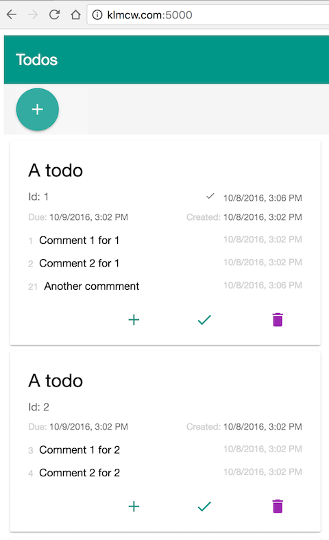

# todocore
<span style="float: right">[License](LICENSE)&nbsp;</span>
<span>[](https://circleci.com/gh/klmcwhirter/todocore)</span>


This is an app written based on .NET Core, ASP.NET Core, AngularJS 2 and Material.

It is my first attempt at writing a SPA using ASP.NET Core and
is a simple (naive) implementation of the [Todo application made famous by John Papa](https://johnpapa.net/inside-the-asp-net-single-page-apps-template/).


* [.NET Core](http://dot.net) is an Open Source version of the Microsoft .NET platform.

* [ASP.NET Core](http://www.asp.net/core) is an Open Source version of the Microsoft ASP.NET framework.

* [AngularJS 2](https://angular.io/) is the next version of AngularJS built from the ground up to support features of ECMAScript 6.

* [AngularJS 2 Material](https://material.angular.io/) are the material design components for AngularJS 2.

* [Sqlite](https://www.sqlite.org/) database - but could easily use another database by using a different [EF Core data provider](https://docs.efproject.net/en/latest/providers/index.html#).

# How to run the app
```bash
# download the docker image
docker pull klmcwhirter/todocore
# start a container
docker run -d -p 5000:5000 --name todocore klmcwhirter/todocore
docker logs -f todocore
# seed the database
./etc/seed.sh
```
*Note to execute the seed.sh script you may want to clone the repository.*

Go to [http://localhost:5000/](http://localhost:5000/) in your browser

You will see a list of 10 todo items displayed. The big plus sign in the toolbar at the top allows you to add a new todo task. There are actions on each card; one to add a new comment, one to toggle the todo item
complete status, and another to delete the todo item.



# Todos Web Api
The TodosController provides the following API endpoints.

### Return the list of todos as JSON
```http
GET api/todos HTTP/1.1
```

### Return the todo with Id of 5 as a JSON list
```http
GET api/todos/5 HTTP/1.1
```

### Create a todo based on the {todo} passed in; return the list of todos as JSON
```http
POST api/todos HTTP/1.1
content-type: application/json

{todo as JSON}
```

### Create a todo comment for todo 5 based on the {todoComment} passed in. Note only the text field is used.
```http
POST api/todos/5/comment HTTP/1.1
content-type: application/json

{todoComment as JSON}
```

### Update the todo with Id of 5 based on the {todo} passed in. By default the {todo} is expected in JSON format; return the list of todos as JSON
```http
PUT api/todos/5 HTTP/1.1
content-type: application/json

{todo as JSON}
```

### Mark the todo with id 5 as completed; return the list of todos as JSON
```http
PUT api/todos/markComplete/5 HTTP/1.1
content-type: application/json

```

### Delete the todo with Id of 5; return the list of todos as JSON
```http
DELETE api/todos/5 HTTP/1.1
```

### Create a sample todo
```http
GET api/create HTTP/1.1
```

### Create a sample todo and pass in a word to use in the task name.
It Will pick the appropriate article to use based on whether the word begins with a vowel or not. e.g., A topical Todo *or* An underlying Todo
```http
GET api/create/word HTTP/1.1
```
